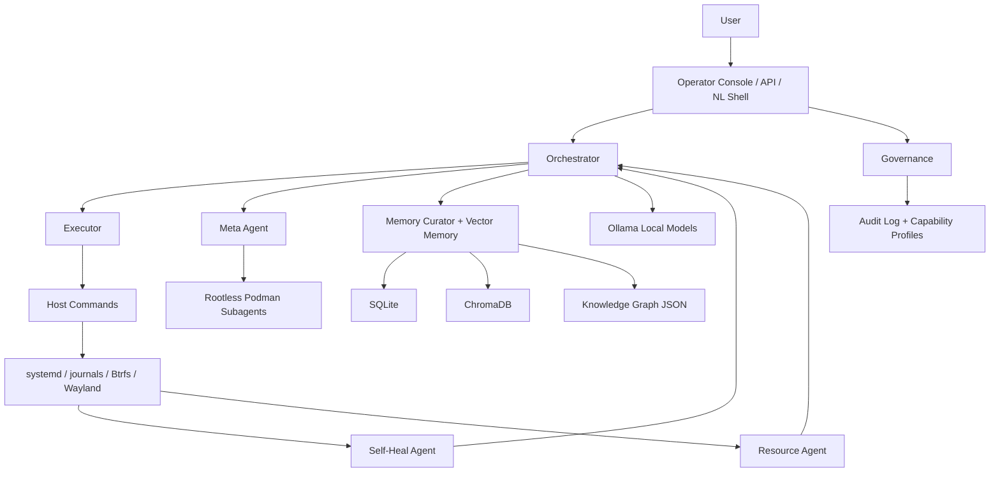

# AetherOS Architecture

## Layers

- Host layer: `systemd`, Ollama, Podman, Btrfs, Hyprland
- Control layer: orchestrator, executor, governance, self-heal, resource, API
- Memory layer: SQLite, Chroma, JSON graph, curator
- Meta layer: subagent job queue plus Podman subagent containers
- Interface layer: operator console, status CLI, API, shell, Wayland session

## Primary entrypoints

- `install.sh`
- `bin/aether`
- `bin/aether-up`
- `bin/aether-status`
- `bin/aether-operator`
